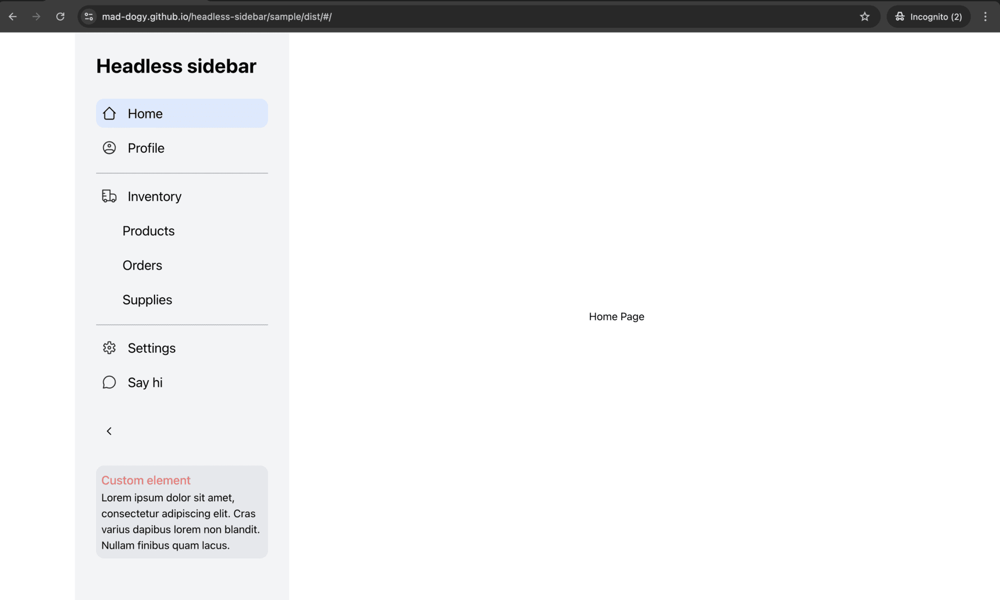
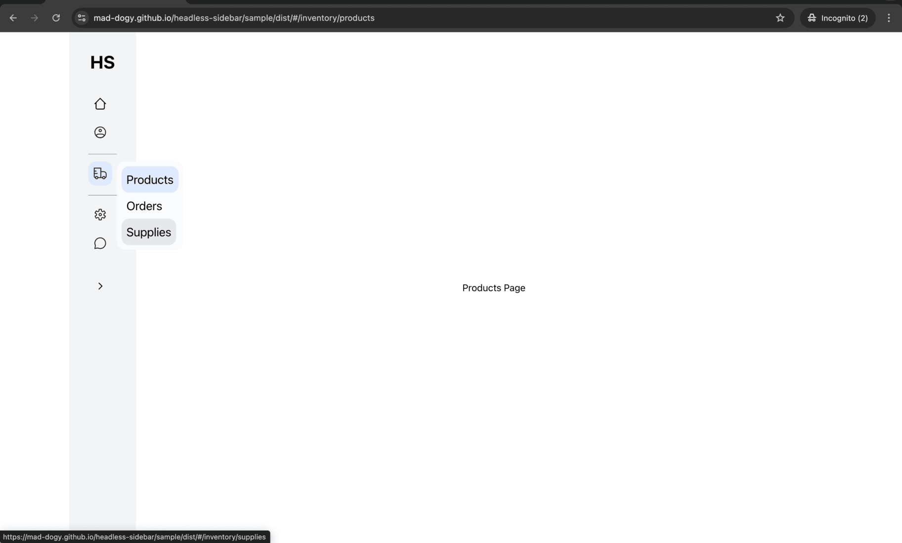
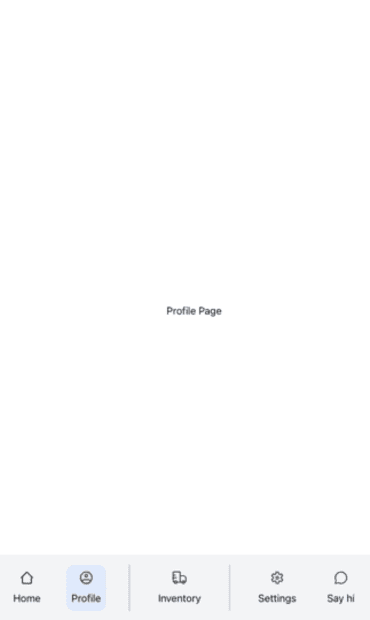
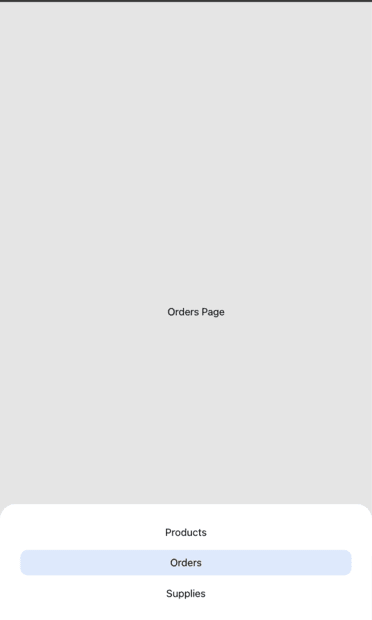

# headless-sidebar

Headless-sidebar is a user interface library that includes an unstyled, accessible UI sidebar component developed as a test task from HelloClient. 

The library was developed with usage of React, TypeScript, Tailwind and JSX-notation. The component provides a convenient component API in which integrating such a menu does not cause difficulties. In the usage example, you may see react-router-dom integration.

## Documentation

The sidebar component was designed with usage of compound components. This adds flexibility to customization and intagration.

An example of using headless-sidebar is available to view online via GitHub Pages by [link](https://mad-dogy.github.io/headless-sidebar/sample/dist/)

The code of an example of usage is located in [/sample](/sample) directory. 


## Get started with sample

- Start project in dev mode.
```bash
  cd sample && yarn dev
```

- Start project in prod mode.
```bash
  cd sample && yarn preview
```

- Build project.
```bash
  cd sample && yarn build
```

## Components description

Headless-sidebar provides a set of components to build your custom sidebar.

List of components:
1. **Sidebar** is a root headless-sidebar component, also this component provides access to other available components  
```
  <Sidebar>
    {children}
  </Sidebar>
```
2. **Title** is a component that takes as props title text.
```
  <Sidebar.Title title="Title" />
```
3. **Menu** is a wrapper component to all MenuItem components.
```
  <Sidebar.Menu>
    {children}
  </Sidebar.Menu>
```
4. **MenuItem** is a crutial sidebar component from which is build sidebar menu. It has a list of props:
    - *classNames* is an object that takes classNames to different parts of an item
    - *icon* takes an icon of menu item
    - *label* takes an menu item label text
    - *children* an alternative to label, when you want to customise component
    - *RootComponent* takes a ReactElement component that change default button tag to custom
    - *active* takes boolean flag 
    - *onClick* takes a callback, which will be executed when the user click on menu item component
```
<Sidebar.MenuItem
  icon={<Icon Svg={ProfileIcon} />}
  label="Profile"
  RootComponent={<NavLink to={routes.profile()} />}
  classNames={{
    activeContainer: 'bg-blue-100 hover:bg-blue-200',
  }}
  active={true}
/>
```
5. **Collapsible** is a component that indicates as menu item, but it includes  sub items. It has a list of props:
    - *classNames* is an object that takes classNames to different parts of an item
    - *icon* takes an icon of menu item
    - *label* takes an menu item label text
    - *children* takes a ReactNode which may contain menu items
    - *active* takes boolean flag 
```
<Sidebar.Collapsible 
  icon={<Icon Svg={InventoryIcon} />} 
  label="Inventory"
>
  <Sidebar.MenuItem label="Products" />
  <Sidebar.MenuItem label="Orders" />
</Sidebar>
```
6. **ToggleButton** is a button component that controls open state of sidebar
```
<Sidebar.ToggleButton onClick={callback} />
```
7. **Custom** is an additional component that takes children as props and display additional content
```
<Sidebar.Custom>
  <div>Custom component</div>
</Sidebar.Custom>
```

## Sample screenshots





